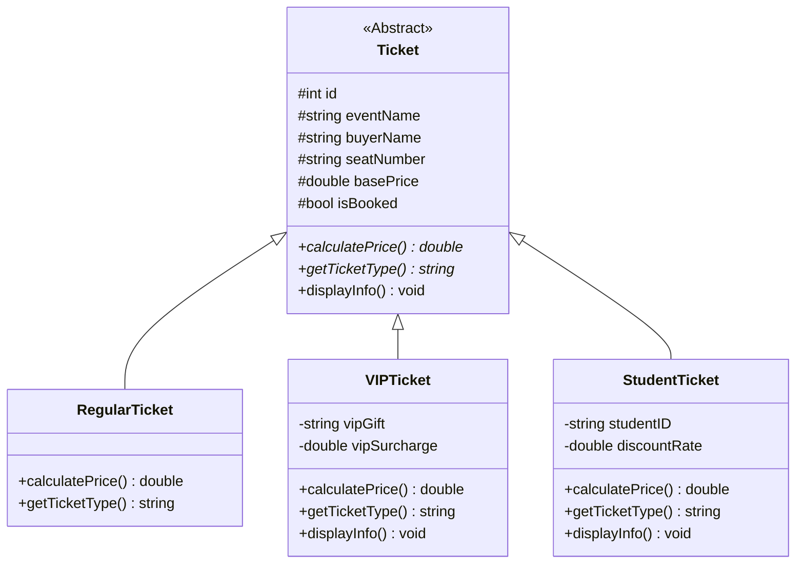

# C++ 門票預購系統 (Ticket Pre-order System)

本專案為 C++ 期末專題，實現了一個功能完整的終端機門票預購系統。專案嚴格遵循軟體工程迭代開發流程，程式碼以 v1 至 v4 分支管理，且未使用 master 作為最終交卷分支。

## 專案亮點與核心特色

1. **物件導向設計 (類別繼承與多型)**：
   - 基底抽象類別 `Ticket` 定義核心售票介面與純虛擬函數。
   - 衍生類別 `RegularTicket`（一般票）、`VIPTicket`（VIP 尊榮票）、`StudentTicket`（學生優待票）實作各自的多型計價（`calculatePrice()`）與權益細節展示（`displayInfo()`）。
2. **STL 類別庫深度應用**：
   - 使用 `std::vector` 與 `std::shared_ptr` 管理記憶體中的多型物件，避免記憶體洩漏並簡化資源生命週期管理。
   - 使用 `std::find_if`、`std::transform` 等 STL 演算法進行門票搜尋、格式化輸入以及欄位篩選。
   - 使用 `std::map`（以資料流形式）處理多項活動的座位映射與關聯。
3. **資料持久化 (檔案讀寫 I/O)**：
   - 動態讀取活動組態檔 `data/events.txt`（包含活動名稱、起始基礎價、座位大小規格）。
   - 即時存取訂單資料檔 `data/bookings.txt`。顧客完成訂票/退票、或管理員重設資料時，系統會立即進行 CSV 檔案序列化與寫入，確保重啟程式後資料不遺失。
4. **終端機 UI 座位表視覺化 (ANSI Escape Codes)**：
   - 模擬視覺化座位網格，採用 ANSI 逸出字元進行色彩標記。
   - 區分 **VIP 票** (黃色)、**一般票** (綠色)、**學生票** (青色)，以及**已售出**的座位 (紅色標記 `[ XX ]`)。
5. **高度防呆機制與輸入驗證**：
   - **大小寫自動相容**：座位號碼（如 `a1` 與 `A1`）、確認選項（如 `y` 與 `Y`）均會自動格式化並轉為大寫匹配，提升輸入友善度。
   - **格式限制**：防止名稱/學號中輸入逗號 `,`（避免破壞 CSV 儲存結構），並防範空值、長度過短學號等錯誤輸入。
   - **數值防呆**：當使用者在選單輸入字串而非數字時，系統會清空錯誤狀態緩衝區並提示重新輸入，防止程式無窮迴圈或崩潰。
6. **管理員統計儀表板**：
   - 分離「顧客選單」與「管理員選單」（需密碼驗證：`admin123`）。
   - 提供各場次座位銷售數量與銷售百分比 (Capacity Rate)，以及一般、VIP、學生票的分類銷售佔比與系統總營業收入。

---

## 專案結構

```
TicketSystem/
├── src/
│   ├── Ticket.h           # Ticket 抽象基底類別
│   ├── RegularTicket.h    # 一般票衍生類別
│   ├── VIPTicket.h        # VIP 票衍生類別
│   ├── StudentTicket.h    # 學生票衍生類別
│   ├── Event.h            # 活動資訊結構
│   ├── DataManager.h      # 檔案存取管理器 (資料持久化邏輯)
│   └── main.cpp           # 主程式驅動與 UI 介面控制
├── data/
│   ├── events.txt         # 活動設定 template (名稱,基礎價,列數,行數)
│   └── bookings.txt       # 預購訂單記錄 (CSV)
├── .gitignore             # Git 忽略檔案設定
├── compile.bat            # Windows MSVC 一鍵編譯腳本
└── README.md              # 說明文件
```

---

## 系統架構圖 (C++ 類別繼承關係)



---

## 編譯與執行指南

本專案專為 Windows 環境編譯進行優化（並內置 UTF-8 中文相容），只需使用您的電腦內建 Visual Studio C++ 編譯器：

1. 開啟您的終端機（CMD 或 PowerShell），切換至本專案目錄。
2. 執行一鍵編譯腳本：
   ```cmd
   .\compile.bat
   ```
3. 編譯成功後，直接執行產生的程式：
   ```cmd
   .\TicketSystem.exe
   ```

*(管理員預設登入密碼為：`admin123`)*
