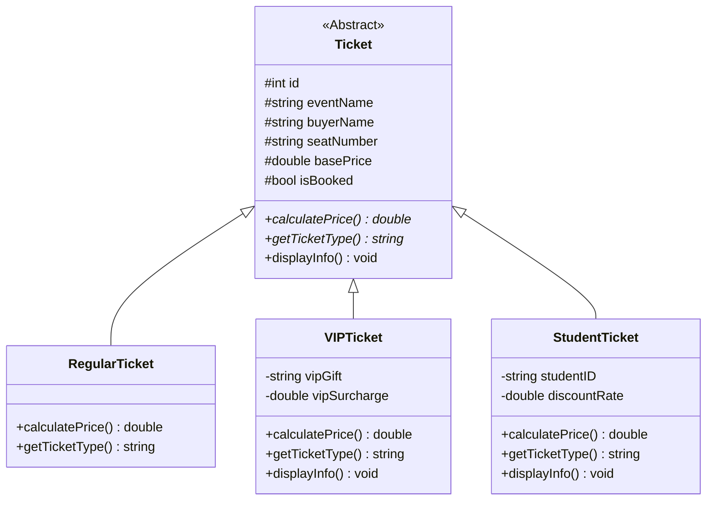

# C++ 物件導向程式設計期末專題報告

## 專題名稱：多功能門票預購控制系統 (Ticket Pre-order System)

---

### 【 專題封面 】

* **學校名稱**：[請填寫您的學校]
* **科系年級**：[請填寫您的科系班級]
* **學生姓名**：[請填寫您的姓名]
* **學生學號**：[請填寫您的學號]
* **指導教授**：[請填寫指導教授姓名]
* **繳交日期**：2026 年 6 月 23 日

---

## 1. 系統功能說明與規格

本系統是一個基於 **C++** 語言開發的互動式「門票預購系統」，專門針對大眾演唱會、體育賽事等場次售票所設計。本系統實現了以下核心期末專題要求：

1. **類別繼承與多型特性**：
   - 系統的核心設計採用了物件導向（OOP）的繼承機制。以抽象基底類別 `Ticket` 作為基底，延伸出三種不同實體票種：
     - **一般票 (RegularTicket)**：維持基礎票價，不附帶額外產品。
     - **VIP 尊榮票 (VIPTicket)**：享有前排黃金座位。計算價格時會自動套用 1.5 倍的票價加權，並加收 500 元的尊榮費，同時附贈「專屬周邊商品」以及貴賓休息室使用權。
     - **學生優待票 (StudentTicket)**：座位分佈於後排。提供學生專屬 8 折優惠，並在預訂時要求輸入並驗證學號，入場時需核對學生證。
   
2. **STL 類別庫應用**：
   - 記憶體生命週期管理：使用 `std::shared_ptr<Ticket>` 來儲存動態多型票券物件，結合 `std::vector` 容器，保證在不需要手動調用 `delete` 的情況下，安全且無記憶體洩漏地管理多個活動的座位。
   - 演算法與轉換：利用 `std::find_if` 進行座位號碼的精準定位，並結合 `std::transform` 實作大小寫輸入相容（例如使用者輸入 `a1` 與 `A1` 均可順利識別），提升終端機 UI 的人機互動介面友善度。

3. **資料持久化 (檔案讀檔與寫檔)**：
   - 系統藉由 `DataManager` 模組，於啟動時自動掃描並載入 `data/events.txt` 活動組態檔。
   - 預購資訊將即時儲存至 `data/bookings.txt` 中。不論是顧客購票、退票，亦或是管理員重設資料庫，變更均會立即寫回硬碟，確保系統關閉後預約狀態得以永久保留。

4. **精美終端機 UI 視覺座位表 (ANSI Color Rendering)**：
   - 在終端機環境下，透過 ANSI Escape Codes，渲染彩色舞台與座位分佈網格。
   - 座位地圖中：
     - 黃色代表 **[座位:V]** (VIP 票券，可用)
     - 綠色代表 **[座位:R]** (一般票券，可用)
     - 青色代表 **[座位:S]** (學生票券，可用)
     - 紅色 **[ XX ]** 代表該座位已被搶購，直觀展現售票實況。

5. **後台統計與控制面板**：
   - 顧客與管理員角色分離。管理員可憑密碼 `admin123` 進入控制台。
   - 提供實時的銷售狀況儀表板：動態計算各場次的座位銷售張數、總座位數、各場次座位銷售率 (Capacity Rate)、三種票券的各自銷售比例，以及整個系統的營業總收入統計。

---

## 2. 系統架構與 C++ 類別設計

### 2.1 類別層級結構圖 (Mermaid Diagram)

---

## 3. 開發迭代流程 (Git 分支規劃)

為展示完整的開發迭代流程，本專案按照功能模組劃分，共提交了 4 個版本，並在其對應的 Git 分支進行了獨立開發：

* **v1 分支 (核心 OOP 設計)**：
  - 定義基礎抽象類別 `Ticket` 與三個衍生子類別（一般、VIP、學生票）。
  - 實作多型計算價格與輸出介面，提供記憶體內的簡單文字預約測試。
* **v2 分支 (檔案讀寫與持久化)**：
  - 實作 `DataManager` 模組，載入外部 `events.txt` 並即時寫入 `bookings.txt`。
  - 支援動態載入多個活動項目，購票記錄在重啟程式後依然保留。
* **v3 分支 (互動式視覺 UI 與座位圖)**：
  - 實作 ANSI 座位彩色網格輸出。
  - 新增角色選單，將顧客模式與管理員控制台功能進行分離。
* **v4 分支 (營收控制台與輸入防呆強化)**：
  - 實作管理員營收分析與銷售率統計儀表板。
  - 增加大小寫不敏感輸入轉換、姓名/學號逗號防呆驗證、以及輸入流類型防呆，防止程式出錯崩潰。

---

## 4. 程式執行畫面截圖與說明文字

*【提示：請在以下各部分插入您執行程式時的視窗截圖】*

### 4.1 系統登入與角色選單畫面
> **[請在此處插入系統主選單截圖]**
> * **說明文字**：程式啟動時，會顯示門票預購系統主選單。使用者可以輸入數字 `1` 進入顧客購票模式，輸入 `2` 登入管理員控制台（需輸入 `admin123`），或輸入 `3` 關閉系統。

### 4.2 顧客活動選擇與視覺化座位表
> **[請在此處插入顧客選擇活動及座位圖輸出截圖]**
> * **說明文字**：顧客進入購票系統後，可看到載入自 `events.txt` 的多場演唱會清單。選擇場次後，可檢視其專屬的彩色座位圖。前兩排黃色為 VIP 區，中間綠色為一般區，最後一排青色為學生區。已售出位置顯示為紅色的 `[ XX ]`。

### 4.3 顧客購票與多型票價計算
> **[請在此處插入預購門票輸入及成功訊息截圖]**
> * **說明文字**：使用者選擇座位號碼（不分大小寫）並確認後，系統會根據座位所處區域判定票種。例如，選取前排位置會提示為 VIP 票並顯示專屬禮物，確認購買並輸入姓名後，系統即時存檔並列印票券明細。

### 4.4 顧客退票與即時檔案同步
> **[請在此處插入退票及bookings.txt檔案變更截圖]**
> * **說明文字**：若顧客需取消預訂，只需在顧客選單中點選「取消預購」，輸入座位編號，經二次確認後，系統會釋出該座位。此時開啟 `bookings.txt` 可以觀察到該筆預訂紀錄已被清除。

### 4.5 管理員統計分析儀表板
> **[請在此處插入管理員營收統計畫面截圖]**
> * **說明文字**：登入管理員控制台後，選擇「查看系統營收與票種銷售統計」，即可獲得極為精細的報告。報告中顯示了各個場次目前的銷售張數、總座位數、精確的銷售百分比，以及一般、VIP、學生票的售出張數與全系統總營業額。

---

## 5. GitHub 儲存庫網址

* **專案 GitHub 網址**：`https://github.com/[您的帳號]/[您的儲存庫名稱]`
* **分支說明**：
  - 本專案沒有將代碼提交至 `master`，而是建立了 `v1`、`v2`、`v3`、`v4` 分支，分別儲存各個開發階段的完整原始碼，您可以切換至各分支來檢驗專案的迭代軌跡。
